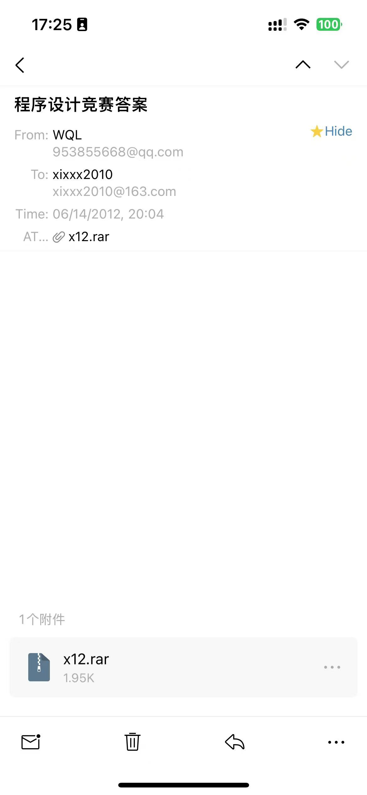

# Code-Memory

This is just for memorizing my Quick-Basic45 (**QB45** in short, it's a low-level programming language, the IDE is all in blue color.) codes writing in elementary school, which won the **1-st** Beijing Shunyi District **Champion** in Java/C#/Basic Programming Competition **when I was 12**. If you are interetsted in code, you may find in the `codes` folder, while nowadays people forgot that tedious and classic language which also need compiled. Below it's my first email sent in life to my elementary teacher in that time coz she told me that I won the championship after checking the results:

  

After I was 12, I did't code anymore till one or two years ago and I am trying to learn more for both mathematics and codes~~
